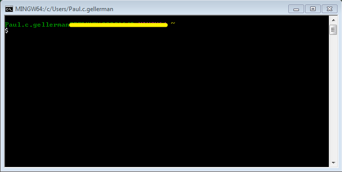
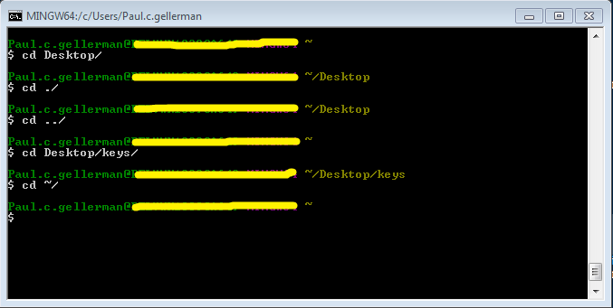
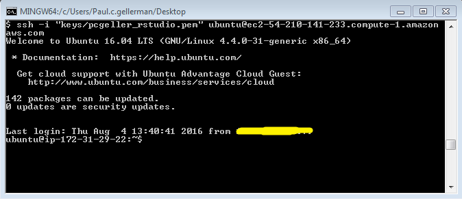
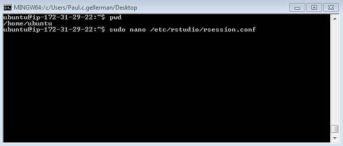
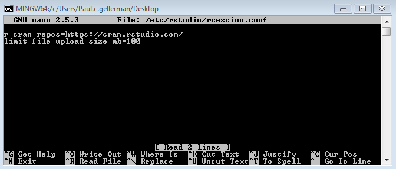

##Introduction

If you're coding then inevitably you'll run into Linux.  This can be an intimidating prospect since from Government computers you'll likely only have access to the Linux server through a command line interface (CLI).  This primer is meant to give you the basic skills to navigate the CLI and accomplish your task.  

This tutorial focuses on Ubuntu (which is a very popular Debian based Linux distribution - if you ever want to get into a nerd fight tell someone that they're using an inferior Linux distro). However, most of these commands can be used in any BASH (Born Again Shell) environment, including GitBASH.

##Overview

This tutorial will review basics on how to navigate a file structure in a BASH environment and give you some basic commands.  
*  Next we'll connect to the backend of an Rstudio server running on AWS using GitBASH.  
*  After that we'll open one of Rstudio's configuration files make some edits.  
*  From there we'll copy a local file from your local computer to the remote server.     
*  We'll close the connect and go `~`  ... hopefully at the end of this you'll get the joke... and still not find it funny.

## Requirements

Most likely you'll be remotely connecting to a remote server using from your Windows based desktop.  For this you'll need a client program which can establish SSH (secure shell) connections.  I know of two CONs for software that can do this: PuTTy and Git-scm.  You'll need to have one of these installed - this post was written using Git-scm which gives you a nice BASH terminal; this nicely mimics an Ubuntu terminal (which also uses BASH).

The other requirement is a server to connect to.  If you're using RStudio on AWS this is an Ubuntu server.  


###Navigation basics

First start GitBash.  You should have a prompt that looks like this:
(without the big yellow line)


First you'll notice you're username and the computer you're currently connected from (which is yellowed out).  
There are two other characters, these aren't commands but tell you about your current location:  
`~` = This means you're currently in your home directory.  
`$` = This is the terminator for most shell prompts.  Basically you'll type in any commands after this.  If you hit enter and the next line doesn't end with this then it means another program is accepting the input, not the shell. 

Some basic commands:  
`pwd` = "present working directory" to see your current file path.  
`ls` = lists all directories and files within your current folder.  
`cd` = change directory - this lets you change your current director.  Like:
```{r, engine = 'bash', eval= FALSE}
cd Desktop/
```
One handy feature is the double tab.  Hitting tab twice after you've started typing a file path or file name will search the current path and attempt to autocomplete it for you.  For example if you're in your windows home directory and type `cd Desk` then hit tab twice it will autocomplete to `cd Desktop/`.   

Some navigation basics:  

`.` = This means look in my current directory.  
`..` = This means look or move to the parent directory.  It can be chained together to rapidly move up a filesystem.  
`~` = This means look or move to your home directory.  

You'll see that after your user@hostname `~` will change to show your pwd.**Don't forget the text I've entered is what appears after `$`** For example:  


###Connecting to a remote (RStudio) server

Now that you know how to look around let's connect to your remote AWS Rstudio server.  AWS makes it easy.  Right click your instance and select connect. No... it won't be that easy.  Lets follow the instructions using GitBASH.

1. Open SSH - Ie; open GitBASH  
2. Locate your private key.  - This was created when you first set-up your instance.  If you didn't save it then you're SOL and will need to start a new instance and save your key in a safe place since it can't be downloaded after the option has passed.  

I keep mine in a `/keys` folder on my desktop. To get there I'll type  
```{r, engine='bash', eval = F}
pwd #to make sure I'm in my home folder.  If not then:
cd ~ #brings me home 
cd Desktop/keys #moves me into my keys folder
ls # to show all of the keys I have stored there. 
```

3. Your key must not be publicly viewable for SSH to work.  Now's a good time to take a brief aside to overview the differences between *absolute* versus *relative* file paths.  

#### Absolute File Paths
Absolute file paths means that no matter where you are in the file tree execute or navigate to the exact place that you specify.  
In GitBASH on Windows you can type the command below to goto that location no matter where you are in the file tree:
```{r, engine='bash', eval = F}
cd C\:/Users/Paul.c.gellerman/Desktop
```

The `\` in the above example is an escape character.  Escape characters tells the interpreter (the program that is interpreting the code you type) that even though the following character means something to you, forget about that and treat it as a regular character.  You'll need to use this if you have a folder or file name with spaces.  Such as `C\:/My\ Folder\ Can\ Now\ Be\ Accessed.txt`.  Instead ofthe interpreter thinking that the space means another parameter to the command it now knows that the space should be treated as part of the file name.  

In Linux the file structure is a little bit different.  First, we can lose the concept of drive letters (A:/, B:/, C:/)  Everything in Linux originates from the root folder which is designated by `/`.  This is the top level of the entire file structure and files are accessed in a manner similar to Windows:

```{r, engine='bash', eval = F}
cd /home/mydirectory/myfiles
```


#### Relative File Paths
Relative file paths have similar syntax and behaviour in both Windows and Linux. They work *relative* to your current location in the file structure. Assume I have a small file structure that looks like this : `/home/mydirectory/myfiles`.  I'm currently in `/home/mydirectory`.

```{r, engine='bash', eval = F}
pwd #would return /home/mydirectory
cd ./ # this would keep you in /home/mydirectory
cd ../ #this would move you up to /home
cd myfiles # this would move you down to myfiles
```

These commands say that relative to the current location move up or down the file tree or navigate to a different location.  

###Connecting to RStudio cont'd

3. Your key must not be publicly view able for SSH to work. This means you'll need to change the permissions on the file. There are two ways to do this using *absolute* or *relative* file paths.  

If you know where you are in the file structure and where your keys are located you can use *relative* paths.  Say I know I'm at `C:/Users/Paul.c.gellerman/Desktop` and I know the keys are in `C:/Users/Paul.c.gellerman/Desktop/keys/mykey.pem` then I can execute the `chmod` command without ever changing directories using:  
```{r, engine='bash', eval = F}
pwd # would return c/Paul.c.gellerman/Desktop
chmod 400 keys/mykey.pem
pwd # would still return c/Paul.c.gellerman/Desktop
```
The other option is to explicitly say where the file is using *absolute* paths.  Using the above path for my keys I could execute the command **anywhere** in the file structure:
```{r, engine='bash', eval = F}
chmod 400 C\:/Users/Paul.c.gellerman/Desktop/keys/mykey.pem
```

Both of these allow you to execute a command on a file or folder without having to explicitly navigate to that location.  

Now you're ready to actually connect. This is done using a program that is capable of establishing a SSH (Secure Shell) connection. You'll need the public DNS for your RStudio server. This can be found by right clicking and choosing connect on AWS and then using the information under #4. It can also be found on the bottom of the page under "Description - Public DNS".  

In GitBASH you can establish an SSH connection using:
```{r, engine='bash', eval = F}
ssh -i "path/to/your/key.pem" username@server
```

Note that you can specify either the relative or absolute file path for your key. AWS will tell you the username(always Ubuntu for RStudio) and server address(Public DNS) under the Connect information.  

For AWS that will look like: 
```{r, engine='bash', eval = F}
ssh -i "pcgeller_rstudio.pem" ubuntu@ec2-54-210-141-233.compute-1.amazonaws.com
```

Hit enter and then type "yes" when asked if you'd like to trust the connection.  You'll see a screen like this:
  

You are now connected to Ubuntu on your AWS RStudio server!  So what can you do?  Lets edit RStudio's configuration file to increase the upload file size limit.

##Editing a remote file

One of the first things you should notice is that the shell prompt has changed.  It no longer shows the same (Windows) information as it did in GitBASH. That's because you're no longer typing commands that are sent to GitBASH.  All of the commands you type are going directly to the Ubuntu server.

You can find out your location by `pwd`, see the contents of your location using `ls`, and all of the other commands reviewed before.  

You can also use a command that's not included in GitBASH called `man` (short for manual).  This is one of the most helpful Linux commands you can know because it will tell you about what other commands do. Try:  

```{r, engine='bash', eval = F}
man pwd
man ls
man cd
```

The RStudio configuration file is located in `/etc/rstudio/rsession.conf`.  Linux versions have a very simple text editor called `nano` that we can use to edit this file.  

```{r, engine='bash', eval = F}
nano /etc/rstudio/rsession.conf
```

If you execute this command you'll notice that `nano` starts and shows the contents but it says that you don't have write permission to save the file.  Oops! Exit `nano` by hitting **CTRL + x**.  The command needs to be run as a user with more permission than you have.  This can be done by using the `sudo` command.  

```{r, engine='bash', eval = F}
sudo nano /etc/rstudio/rsession.conf
```

You now have write permission.  In a new line type:  
`limit-file-upload-size-mb=100`

Hit **CTRL + o** to write (save) the file and **CTRL + x** to exit nano.  You've just edited a file located in Amazon's data center that will affect how RStudio works.  Neat!  If you want you can reopen the file to make sure the changes took place.  

Here's a summary:  

  

Now type `exit` to close your connection with the remote server.  You may need to type it more than once if there are stopped jobs.  You'll now be back in your GitBASH terminal.

##Copying a local file to the remote server

If you have a file that's larger than the 100 mb limit you can edit the rsession.conf file or you can use the BASH command `scp` (Secure Copy) to transfer the file from your local to remote machine.  The first method requires connecting, editing the .conf file, and then uploading your file.  The second method can be completed in one line.  It takes the form:  
`scp -i path/to/your/keys.pem local/source/path/file.txt user@server:remote/destination/path/file.txt`

On the Ubuntu server RStudio project folders are stored in `/home/rstudio/`  

So using scp will look like:

```{r, engine='bash', eval = F}
sudo scp -i /c/Users/Paul.c.gellerman/Desktop/keys/pcgeller_rstudio.pem /c/Users/Paul.c.gellerman/Desktop/myfile.txt ubuntu@ec2-54-210-141-233.compute-1.amazonaws.com:/home/rstudio/myproject/myfile.txt
```

Try navigating to the remote location to make sure your file transferred correctly.  

That's it. There are loads of things that can be done in Linux that are just plain difficult in Windows so keep exploring the OS if you're not familiar with it.  As always you can find loads of help on Google, Stackoverflow, or on the Ubuntu forums.  
